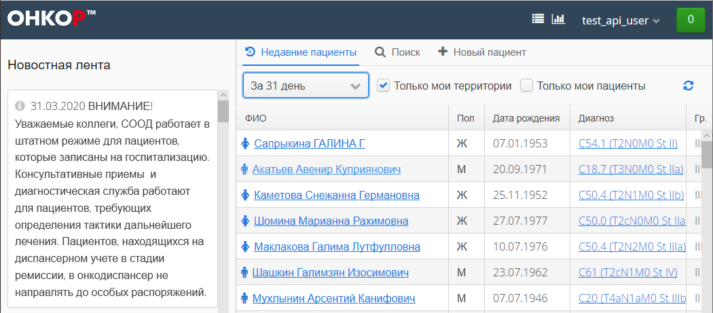

## Создание отслеживание состояния записи "Заявка на ДЭЗО" посредством пользовательского интерфейса

1. Аутентификация в ОНКОР должна быть произведена с учетной записью с соответствующими правами `(test_api_user)`

1. Выбрать пациента для формирования "Заявки на ДЭЗО"   
      
    
1. Выбрать пункт выпадающего меню: `+ Новая запись` - `Телемедицина` - `Заявка на ДЭЗО`
      
    
1. Заполнить форму "Заявка на ДЭЗО"  
      

1. Изменение статусов обработки заявки отображается в заголовке записи   
     
   
1. Получаемые документы от РИС отображаются отдельными записями   
     
   
1. При просмотре медицинских записей по [прямой ссылке](methods/rc/link/index.md) производится автоматический переход в историю болезни соответствующего пациента
     